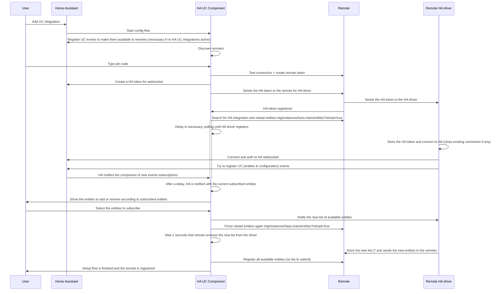

```mermaid
sequenceDiagram
    participant User
    participant Home Assistant
    participant HA UC Component
    participant Remote
    participant Remote HA driver
    User->>Home Assistant:Add UC integration
    Home Assistant->>HA UC Component:Start config flow
    HA UC Component->>Home Assistant:Register UC events to make them available to remotes (necessary if no HA UC integrations active)
    HA UC Component->>HA UC Component:Discover remotes
    User->>HA UC Component:Type pin code
    HA UC Component->>Remote:Test connection + create remote token
    HA UC Component->>Home Assistant:Create a HA token for websocket
    HA UC Component->>Remote:Sends the HA token to the remote for HA driver
    Remote->>Remote HA driver:Sends the HA token to the HA driver
    Remote->>HA UC Component:HA token registered
    HA UC Component->>Remote: Search for HA integration and reload entities intg/instances/hass.main/entities?reload=true
    activate HA UC Component
    HA UC Component->>HA UC Component:Delay is necessary, polling until HA driver registers
    Remote HA driver->>Remote HA driver:Store the HA token and connect to HA (close existing connection if any)
    Remote HA driver->>Home Assistant:Connect and auth to HA websocket
    Remote HA driver->>Home Assistant:Try to register UC (entities & configuration) events
    Home Assistant->>HA UC Component:HA notifies the component of new events subscriptions
    deactivate HA UC Component
    HA UC Component->>HA UC Component:After a delay, HA is notified with the current subscribed entities 
    HA UC Component->>User:Show the entities to add or remove according to subscribed entities
    User->>HA UC Component:Select the entities to subscribe
    HA UC Component->>Remote HA driver:Notify the new list of available entities
    HA UC Component->>Remote: Force reload entities again intg/instances/hass.main/entities?reload=true
    HA UC Component->>HA UC Component:Wait 2 seconds that remote receives the new list from the driver
    Remote HA driver->>Remote:Store the new list (? and sends the new entities to the remote)
    HA UC Component->>Remote:Register all available entities (no list to submit)
    HA UC Component->>User: Setup flow is finished and the remote is registered
```
